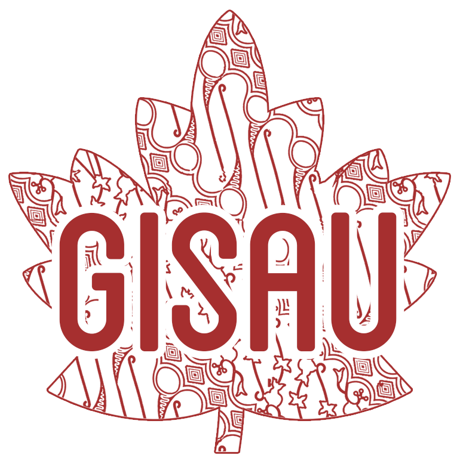

# GISAUBC

Gado-Gado Indonesian Student Association of UBC

Founded in early 2000s, the Gado-Gado Indonesian Students Association of UBC (GISAU) exists to create an open, close-knitted and connected community which exemplifies the signature Indonesian warmth and welcomes the diversity of Indonesian students in UBC Vancouver campus.

 

`Here's a quick preview of our page!`
 

## Reports and Requests

**Bug Report:** If you come across an error message or encounter any issues on the website, please create a bug report.

**Feature Request:** If you have any ideas or if there are specific functionalities that you believe would improve GISAU's website, making it more user-friendly and efficient, please submit a feature request.

**Documentation Request:** If you are browsing the website and feel that certain information or instructions are missing or unclear, please submit a documentation request.

## Contributors

`Teamwork makes the dream work!`
 

[<kbd>   :sunglasses: Christopher Hadrian   </kbd>](https://github.com/chrishadrian)
[<kbd>   :computer: Julian Widjaja   </kbd>](https://github.com/Julian-UBC)
[<kbd>   :art: Jena Arianto   </kbd>](https://github.com/jenaarianto)
[<kbd>   :smiley_cat: Marie Samantha   </kbd>](https://github.com/msamanthaf)

## License

Copyright (c) 2023 GISAUBC under the MIT License
