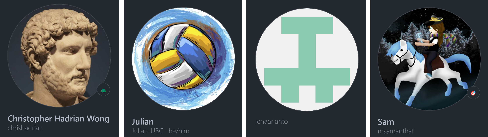

# GISAUBC

> Gado-Gado Indonesian Student Association of UBC

Founded in early 2000s, the Gado-Gado Indonesian Students Association of UBC (GISAU) exists to create an open, close-knitted and connected community which exemplifies the signature Indonesian warmth and welcomes the diversity of Indonesian students in UBC Vancouver campus.

 
This is our official public website deployed under the domain: https://gisaubc.com/
 

`Here's a quick preview of our page!`
 

## Key Features

Insert key features here

## Contributors

`Teamwork makes the dream work!`
 

 

[<kbd>   :sunglasses: Christopher Hadrian   </kbd>](https://github.com/chrishadrian)
[<kbd>   :computer: Julian Widjaja   </kbd>](https://github.com/Julian-UBC)
[<kbd>   :art: Jena Arianto   </kbd>](https://github.com/jenaarianto)
[<kbd>   :octocat: Marie Samantha   </kbd>](https://github.com/msamanthaf)

## License

Copyright 2023 GISAU under the MIT License
